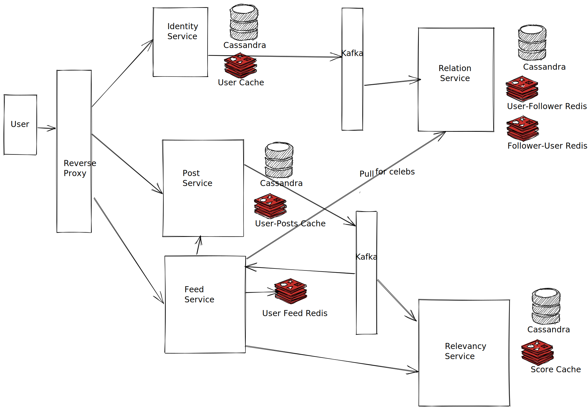

News Feed System

* Scope : Designing News Feed for Facebook
* User Cases
  * Who is going to see it ?
  	 * Users using facebook on mobile, desktop or tablet
  * How are they going to use it?
  	* When users go to their home pages, they will see updates from their friends based on particular order.

* Contraints
  * Feeds can contain images, videos or just text and a user can have a large number of friends.
  * Billions of users accessing facebook each day
  * Read heavy : Many users spend time browsing than creating posts. 

* Capacity Estimations
  * 1 billion users each day
  * Are these users geographically distributed ? (Peaks at different times)
  * Hourly penetration : 50%
  * 500 Million users per hour
  * 150K users per second
  * What does 150K users mean ?
  * Each person do 1 post per day average. (Most of the users dont post) 1 billion posts per day
  * Each person has on average 100 friends.
  * Each person checks out feed 10 times per day.
  * Posts WPS : 150K posts per second
  * Feed QPS : 1.5 M per second

* Break into subproblems
  * Data Model
  * Feed Ranking
  * Feed Publishing
  * Celebrity Feeds

* Data Model
	* User : userId, name, registrationDate
	* Feed : feedId, feedType, content, metadata (supports images and videos)
	* Using Relational database, we would need to store relations as well.
		* User feed relation : UserFeed Table that contains userId and feedId
		* Friend relation : adjacency list. Friends Table that contains 2 userIds to model friend relation.
	* System will fetch userIds of friends from Friends table.
	* Then, it fetches feedIds for all friends from UserFeed table.
	* Feed content is fetched from Feed table based on feedID.
	* Optimization
		* Keep Feed content with UserFeed table to avoid the joins. (Denomalization)
		* Disadvantages
			* Data redundancy : storing redundant data
			* Data consistency : When updating feed, need to update both Feed and UserFeed table.
	* With MySQL, all services share a distruted database and it becomes a single point of failure of all services. 
	* With microservice architecture, we give responsibility of one kind of database to a single microservice. 
	* We don't have a requirement for queries on different columns apart from ids.
	* With MySQL, we would need to perform joins over the network in different shards.
	* NoSQL:
		* Cassandra or DynamoDB : Stores userId relation with other userId, feed table as separate with feedId and userId.
		* Graph DB : users act as nodes, indexed on userId, and relations as edges. Sharding is NP Hard. (edge cut or vertex cut)
		* We can go with Cassandra for its configurability. 
	* Redis:
		* We maintain a computed mapping in Redis for a list of users a user is friend with. 
		* Redis because it also acts as persistent storage giving benefits of cache.
	* Sharding:
		* Sharding based on userId.
			* Getting friends for all users may span in multiple shards.
			* We can store 2 rows for each friend relation. But this increases redundancy of data. (needs double the space)
		* Sharding on location and then on userId.
			* Users are generally friends with other users in same geography

* Ranking
	* Why do we need ranking ? How do we make sure our ranking algorithm works ?
	* There can be several parameters to evaluate that, user stickiness, ads revenue, retention period, user engagement
	* A better ranking system can significantly improve these metrics potentially.
	* Calculate a feed score based on different paramteres and rank feeds by its score.
	* features that are mostly relevant to the importance of the feed, e.g. share/like/comments numbers, time of the update, whether the feed has images/videos etc.
	* EdgeRank at FB:
		* When a user interacts with a news update, we create an Edge.
		* Affinity Score : affinity score evaluates how close you are with this user
		* Edge Weight : importance of each edge. For instance, comments are worth more than likes.
		* Time Decay : The older the story, the less likely users find it interesting.
		* For each feed you create, multiply these factors for each Edge then add the Edge scores up and you have an update’s EdgeRank.
		* And the higher that is, the more likely your update is to appear in the user’s feed.

* Feed Publishing
	* 2 kinds of publishing
	* Push
		* Fanning out to all friends feed. 
	* Pull
		* Pulling user feed when requested. 
	* Computing feed when requested in a heavy read operation on DBs. Scaling it to million reads per second wont scale.
	* We precompute the feed for each user and store that in Redis. 
	* When a post is created, it is appended into all users feed data as per ranking.
	* We can further refine this by fanning out to active users only and using pull for inactive users. 
	* For users with millions of friends/followers and they posting multiple times a day, fan-out won't scale and put stress on the system.
	* When a user access a feed, we check for all the celebrities feed to check if we need to pull anything and insert into user's feed.
	* What if a celebrity is a friend with celebrity and both having millions of friends/followers. 
 	* We can also maintain a redis cache for each user with list of celebrities who posted. This will reduce the search space to handful of celebs.

