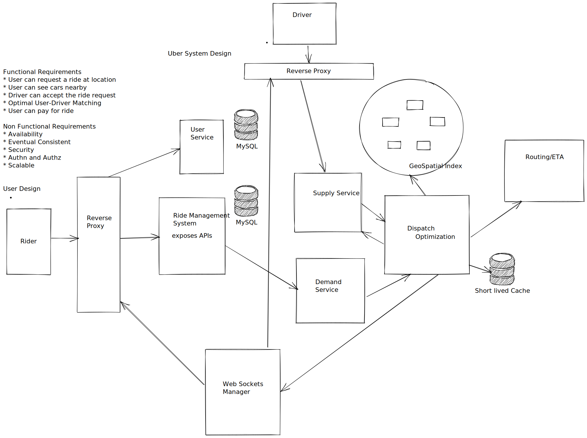

Uber System Design 

* Transporation platform connecting riders and drivers
* Challenge : Matching a dynamic demand with dynamic supply in realtime. 
* Dispatch system -- matches drivers with riders. Real time market platform

Architecture Overview 
* Dispatch : Clients connect to dispatch system which matches riders and drivers, the supply and demand
* Maps/ETA : for dispatch to make intelligent choices, its necessary to get routing and ETA information, street maps, historical travel times
* Post Trip Pipeline : After trip processsing, rating, emails, payments

Dispatch System
* To support city sharding and support more products the idea of supply and demand needs to be generalized
* So, Supply and Demand services are created

Supply Service 
* track capabilities (no of seats) and state machines (available, on ride) of all the supply
* allocation needs to be tracked, number of seats occupied already.

Demand Service
* tracks requirements, orders and all aspects of demand
* if a rider requires a car seat, the requirement must be matched with inventory
* if a rider can share a car, it must be modelled
* what if it is a food delivery or package movement

DISCO (Dispatch Optimization)
* logic to match all of supply and demain
* planning into the future and making use of information as it becomes available like changing route of in progress trip
* Geo by supply : A geospatial index is required for DISCO to make its decisions based on where all the supply is and where it is expected to be.
* Geo by demand : A geo index is also required for demand
* A better routing engine is required to make use of all this information.

Geospatial Index
* Must be super scalable. Design goal is to handle a million writes per second. 
* The write rate is derived from drivers that send update every 4 seconds as they move around.
* The read goal is for many more reads than writes per second because everyone with an open app is doing reads.
* Can only track dispatchable supply (drivers that are available), so global index can be stored in memory
* Limitation for sharing rides or rides that are soon completin. In a new world, all supply in every state must be tracked.
* Their projected route must also be tracked. This is much more data.
* The earth is a sphere. It’s hard to do summarization and approximation based purely on longitude and latitude. 
* So Uber divides the earth into tiny cells using the Google S2 library. Each cell has a unique cell ID.
* Using an int64 every square centimeter on earth can be represented. The boxes change shape and size depending on where on the sphere they are.
* S2 can give the coverage for a shape. If you want to draw a circle with a 1km radius centered on London, S2 can tell what cells are needed to completely cover the shape.
* Since each cell has an ID the ID is used as a sharding key. When a location comes in from supply the cell ID for the location is determined.
* Using the cell ID as a shard key the location of the supply is updated. It is then sent out to a few replicas.
* When DISCO needs to find the supply near a location, a circle’s worth of coverage is calculated centered on where the rider is located.
* Using the cell IDs from the circle area all the relevant shards are contacted to return supply data.
* It’s all scalable. Even though it’s not as efficient as you might like, and since fanout is relatively cheap, the write load can always be scaled by adding more nodes.
* The read load is scaled through the use of replicas. If more read capacity is needed the replica factor can be increased.
* Dynamic cell size might be supported in the future. There’s a tradeoff as the smaller the cell size the greater the fanout for queries.

Routing:
* After there’s an answer from geospatial the options must be ranked.
* Goals
	* Reduce extra driving
	* Reduce waiting
	* lowest overall ETA
* Good choices can’t be made by looking only at current availability.
* The idea is that a driver currently transporting a rider may be a better match for a customer asking for a ride than is a currently idle driver that is farther away.
* Picking the on-trip driver minimizes the customer wait time and minimizes the amount of extra driving time for a more remote driver.
* Dynamic conditions are better handled by this model of trying to see into the future.
* All these decisions become more interesting when considering delivering boxes or food.

Dispatch 
* As vehicles move around, updates are sent to geo by supply. 
* To match riders to drivers or just display cars on a map, DISCO sends a request to geo by supply.
* Geo by supply makes a rough first pass filter to get nearby candidate that meet requirements.
* Then the list and requirements are sent to routing / ETA to compute the ETA of how nearby they are not geographically, but by the road system.
* Sort by ETA then send it back to supply to offer it to a driver.
* In airports they have to emulate a virtual taxi queue. Supply must be queued in order to take into account the order in which they arrive.

Scaling Dispatch:
* Consitent Hashing of Geo-spatial indexes
* AP system, trading consistency for availability.
* Gossip protocol, gossip aroung membership set.
* Once all the nodes agree who each other are, they can make lookup and forwarding decisions independently and efficiently.
* can be scaled by adding instances

Dispatch Availability
* Availability is a priority
* Make everything retryable -- requests needs to be idempotent
* Make everything killable -- Fault tolerance
* Break it up into smaller chunks.

